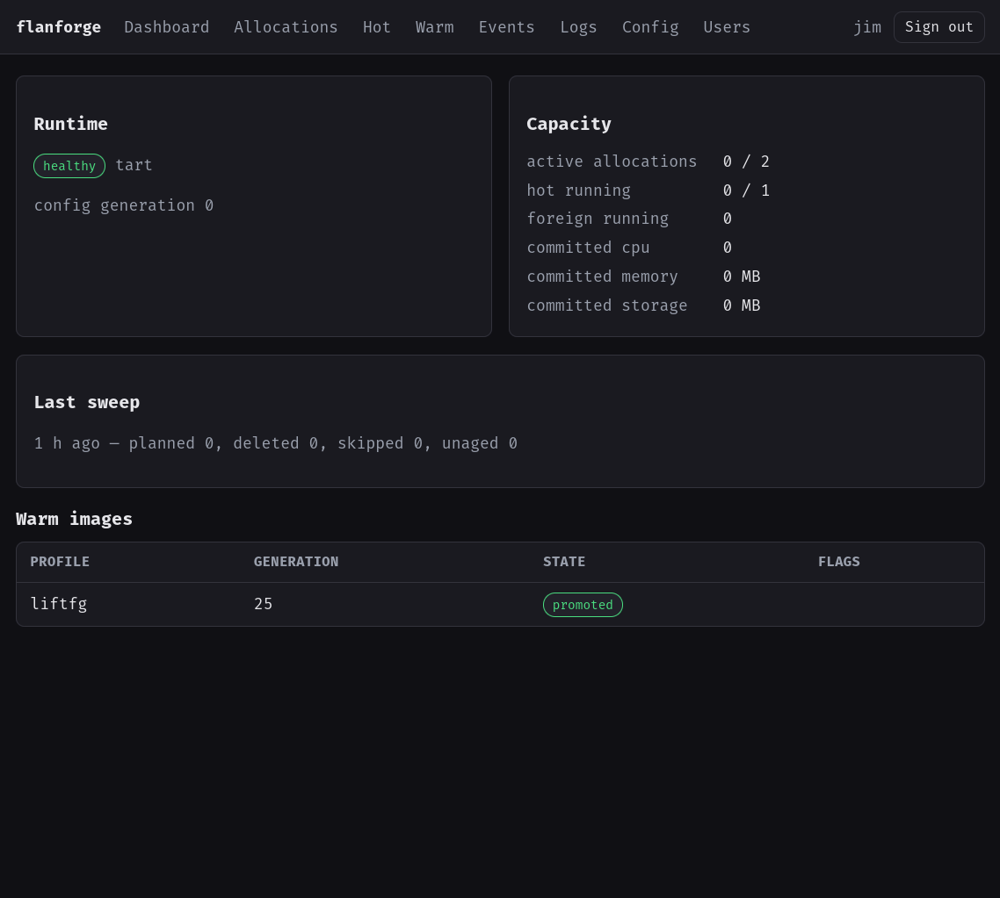
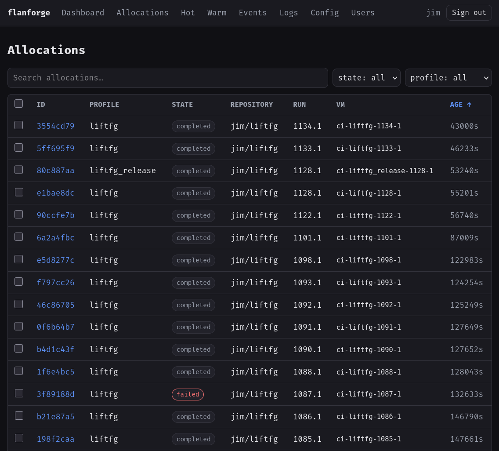

# FlanForge - Just in Time Forgejo Runners

FlanForge runs Forgejo Actions job inside a fresh, disposable VM
so that a build server can run Forgejo jobs without becoming a general
purpose runner. A single daemon, `flanforged`, drives two backends:

- **Tart** on macOS, cloning a retained macOS template.
- **libvirt** on Linux, booting a qcow2 overlay on a published base image.

```text
  Forgejo server ──dispatch──▶ allocator job (an existing Linux runner)
      ▲   ▲                              │
      │   │   allocation request, carrying a Forgejo OIDC identity token
      │   │                              ▼
      │   └─ ephemeral runner ────── flanforged ──clone/boot──▶ guest VM
      │      registration API         (VM host)                     │
      │                                                             │
      └──── forgejo-runner one-job runs exactly that job, then the ─┘
            daemon deletes the guest
```

The **Forgejo server** hosts the repositories and workflows, issues the OIDC
identity token the allocator job presents, and serves the repository-scoped
ephemeral runner registration the guest uses.

The **VM host** runs `flanforged`. It verifies each request, maps it to a 
server-owned profile, drives the backend, registers and supervises the one-job runner, 
and tears the guest down after success, failure, cancellation, or timeout.

**Warning:** This project has not been reviewed for security issues. It is intended 
for internal use on non adverarial networks. Pin a tagged image version as breaking changes 
are expected.

## UI (Optional) 
<p>
  
  
</p>

## Requirements

| | Tart (macOS) | libvirt (Linux) |
| --- | --- | --- |
| Host | macOS on Apple Silicon | Linux/x86-64 with KVM |
| Hypervisor | Tart | libvirt, `virsh`, `qemu-img` |
| Base build | Packer, Darwin/ARM64 runner binary | Packer |
| Service | LaunchAgent `org.fgsec.flanforged` | unit `flanforged.service` |

The configuration lives at
`~/Library/Application Support/flanforge/config.toml` on macOS and
`/etc/flanforge/config.toml` on Linux. Both backends also need:

- **A Forgejo instance with Actions enabled**, and at least one existing runner
  to run the allocator job.
- **A Forgejo API token**, in a file readable only by the service account. The
  daemon uses it against the repository-scoped runner endpoints of every repository named by a
  profile, so it needs repository read and write there.
- **The `flanforged` binary** for the host.

On libvirt the daemon does not have to run on the VM host itself; a remote
connection URI lets it run in a container or on another machine. See
[crates/flanforge-runtime-libvirt/README.md](crates/flanforge-runtime-libvirt/README.md).

## Setup

### 1. Build the base VM

While any custom Tart or Libvirt VM will work as a base, build templates have been
provided as flanforge expects certain files to exist. The `Tart` VM base needs
a Darwin/ARM64 Forgejo Runner binary on local disk which **MUST** be compiled manually
and placed alongside this repository.

```sh
cp templates/tart/.env.example templates/tart/.env
$EDITOR templates/tart/.env
just tart-template-build
just tart-template-test
```

Linux/libvirt produces a qcow2 and a build manifest under
`templates/libvirt/output/`:

```sh
cp templates/libvirt/.env.example templates/libvirt/.env
$EDITOR templates/libvirt/.env
just libvirt-template-build
```

`just libvirt-template-validate` checks the Packer template without KVM, and
`just libvirt-template-test` runs a read-only preflight of the disposable clone
test. Publishing the image into the daemon's storage pool happens in step 3,
because it reads the configuration.

Details, prerequisites, image contents, and every settings key:
[templates/tart/README.md](templates/tart/README.md) and
[templates/libvirt/README.md](templates/libvirt/README.md).

### 2. Generate and edit the config

`flanforged config generate` writes a commented starter document to the
platform config path above, defaulting to the host's native backend. Edit that
copy; `flanforged config view` prints it back, and `config view --resolved` the
effective result.

```sh
flanforged config generate            # --backend tart|libvirt, -o PATH, --force
```

`config.example.toml` and `config.libvirt.example.toml` are complete worked
examples. These are the settings that must be right before the daemon is
useful at all:

- `forgejo.api_url` and `forgejo.api_token_file` — the instance API root and
  the token file from Requirements.
- `oidc.issuer`, `oidc.jwks_url`, `oidc.audience` — the issuer is
  `<instance>/api/actions` and the JWKS URL is
  `<instance>/api/actions/.well-known/keys`; confirm both against the
  instance's `<instance>/api/actions/.well-known/openid-configuration`. The
  audience must equal the one the workflow requests explicitly.
- `server.listen` — reachability is yours to decide; OIDC is verified on every
  allocation request regardless of where it arrived.
- `runtime.state_dir` and `runtime.vm_prefix` — the daemon's private state, and
  the ownership boundary naming what it may delete.
- `runtime.backend` — on Tart, `path` and `runner_host_path`, which must hold
  the Darwin/ARM64 Forgejo Runner the daemon copies into each guest, plus
  `home` whenever Tart's library is not in its default location. On libvirt,
  `uri`, `pool`, and `network`, which must already exist on the host.
- `guest.runner_user` — the unprivileged account the base image provides and
  every job runs as.
- `[guest.ssh]` — required on Tart, where SSH is the only guest control
  channel: `identity_file` is the private key matching the base's account, and
  `known_hosts_file` plus `host_key_alias` pin the template's shared host key.
  On libvirt the default channel is the QEMU guest agent, so the table is
  optional and exists only to seed break-glass login; the daemon pins a freshly
  generated key per allocation there, and both anchor keys are rejected.
- `[profiles.<name>]` — `repository`, `template` (the base name from step 1),
  a `runner_label` unique across profiles, `job_name`, and the
  `allowed_workflows` / `allowed_events` / `allowed_refs` policy the signed
  claims are checked against.

Every option, its default, and the precedence of TOML, `FLANFORGE__`
environment variables, and `--set` overrides:
[crates/flanforge-config/README.md](crates/flanforge-config/README.md).

### 3. Install, grant privileges, and start

`daemon install` validates the configuration and writes files. MacOS
may complain about certain privileges due to `flanforge` being unsigned
so desktop access may be required.

```sh
flanforged daemon install
# macOS only; see below
flanforged daemon priv --grant-firewall --prompt
flanforged daemon start
flanforged daemon status              # or: daemon logs, daemon doctor
```

On Linux, `daemon install` requires root, creates the `flanforge` service user
and its state directory, and enables `flanforged.service`. 

Libvirt base images can be ingested via the CLI as shown below or at boot time
via a configuration value.

```sh
sudo -u flanforge flanforged image import --name flanforge-base \
  --image templates/libvirt/output/flanforge-base.qcow2 \
  --manifest templates/libvirt/output/flanforge-base.manifest.json
```

`flanforged daemon doctor` then reports the libvirt prerequisites — pool,
network, storage headroom, guest key, and service-user access — without
changing anything. `flanforged runtime smoke --profile <name>` boots and
removes one profile-sized guest with no Forgejo job involved.

On MacOS, three permissions may be required to be approved on each install:
Application Firewall, removable volumes, and local network. `daemon priv --grant-firewall` 
grants the firewall, the only gate a command can grant; `--prompt` performs the guarded
access so macOS raises the two consent prompts while you are there to answer
them, and `--check` reports without changing anything. The two are independent
and can be combined. On Linux, `daemon priv` is report-only.

On its first start the daemon writes `operator.token` into `runtime.state_dir`. 
`flanforged allocation` and `flanforged reaper` read it to
reach the host-only endpoint.

Every command and flag:
[crates/flanforge-cli/README.md](crates/flanforge-cli/README.md).

### 4. Wire up the consumer workflow

Copy [examples/apple.yml](examples/apple.yml) into the consumer repository
under `.forgejo/workflows/`, then set the profile name, the allocator job's
runner label, and the daemon URL. Three things must line up:

- The workflow sets `enable-openid-connect: true`. Forgejo does not implement
  GitHub's `permissions: id-token: write`, and without its own key no token
  endpoint is injected.
- The token is requested with an explicit `&audience=…` that equals
  `oidc.audience`. Forgejo defaults an unspecified audience to something else,
  and the token is then rejected.
- The workflow's file name appears in the profile's `allowed_workflows`, and
  the guest job's `name` equals the profile's `job_name`. The daemon binds the
  guest runner to exactly one waiting job with that name in the signed run.

The allocator job POSTs `/v1/allocations` and gets back a runner label once the
guest is booted and registered; the dependent job runs on that label; a final
job DELETEs `/v1/allocations/{id}` to release the slot early. `/healthz` is the
only unauthenticated route.

## Web UI

The daemon serves a web UI at `/ui` on `server.listen`, enabled by default
(`webui.enabled`). It shows allocations, the hot pool, warm images, events,
and the daemon log, and edits the configuration in place, with sensitive keys
view-only.

Sign-in uses the daemon's own accounts — bootstrap the first with
`flanforged webui user add` — with optional OIDC single sign-on under
`[webui.oidc]`. `webui.public_read_only` opens the state views, and nothing
else, to anonymous callers.

## Documentation

- [crates/flanforge-config/README.md](crates/flanforge-config/README.md) —
  every configuration option.
- [crates/flanforge-cli/README.md](crates/flanforge-cli/README.md) — every
  `flanforged` command.
- [crates/flanforge-manager/README.md](crates/flanforge-manager/README.md) —
  allocation lifecycle, admission, and warm per-project bases.
- [crates/flanforge-runtime-tart/README.md](crates/flanforge-runtime-tart/README.md)
  — Tart backend behaviour.
- [crates/flanforge-runtime-libvirt/README.md](crates/flanforge-runtime-libvirt/README.md)
  — libvirt backend, remote connection URIs, and container deployment.
- [webui/README.md](webui/README.md) — building the web UI.
- [templates/tart/README.md](templates/tart/README.md) — building the macOS
  base VM.
- [templates/libvirt/README.md](templates/libvirt/README.md) — building the
  Linux base image.
- [examples/apple.yml](examples/apple.yml) — consumer workflow.
- [examples/regeneration.yml](examples/regeneration.yml) and
  [examples/regeneration-libvirt.yml](examples/regeneration-libvirt.yml) —
  warm base regeneration workflows. Each resets an inherited completion marker
  as its first guest step and creates a fresh mode-0600 marker only as its last;
  FlanForge verifies that handoff and retains the producer-owned guest state.
- [examples/allocate.sh](examples/allocate.sh),
  [examples/allocate.py](examples/allocate.py),
  [examples/allocator.js](examples/allocator.js), and
  [examples/allocator-patient.sh](examples/allocator-patient.sh) — drop-in
  allocator clients.

Each remaining crate under `crates/` carries its own README describing what it
owns.
